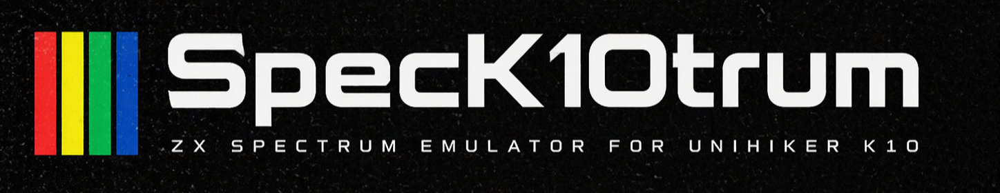
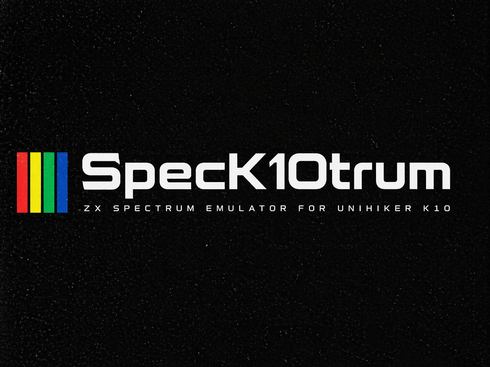

# specK10trum

<p align="center">
	
</p>

Author: Terence Ang

Overview
--------
specK10trum is an ESP32-targeted project implementing a ZX Spectrum emulator and related tooling.

Third-party attribution
-----------------------
- The Z80 CPU core and reference material used in this project are derived from the ZOT project by antirez: https://github.com/antirez/ZOT
- ZOT is licensed under the MIT license. Where code or design ideas from ZOT are used (notably the Z80 core and the Z80/Spectrum spec materials), those portions remain under the original MIT terms. See ZOT: https://github.com/antirez/ZOT

License
-------
This repository is licensed under the MIT License — see [LICENSE](LICENSE) for details.

Gallery
-------

<p align="center">
	
</p>

### Device Photos

<p align="center">
	
	
	
</p>

_Captions: left: project logo; center/right: device photos. To add your own photos, place images in the `assets/` folder and name them `device-1.jpg`, `device-2.jpg` (or update the paths in this file)._ 

This project contains original code by Terence Ang and portions derived from ZOT (MIT). Unless otherwise noted in individual files, ZOT-derived code is distributed under the MIT license.

Build
-----
Build with PlatformIO (environment `unihiker_k10`):

```bash
platformio run --environment unihiker_k10
```

Development
-----------
Prerequisites: install PlatformIO (CLI or VS Code extension), Python 3.8+ and Git. For ESP-IDF based builds, ensure PlatformIO's ESP-IDF toolchain is available via PlatformIO.

- Build: `platformio run --environment unihiker_k10`
- Upload: `platformio run --environment unihiker_k10 --target upload --upload-port COM5` (adjust port)
- Monitor: `pio device monitor --port COM5 --baud 115200`

Configuration notes:
- Board-specific SDK config is `sdkconfig.unihiker_k10` — edit it to enable PSRAM, console routing, and other ESP-IDF options. See the development reference for recommended settings.
- See the full development guide in the docs: [K10 Development Reference](docs/K10_Development_Reference.md)

References
----------
- ZOT (Z80 / Spectrum / CP/M): https://github.com/antirez/ZOT
- Z80 and Spectrum specification documents (used as references) are available inside the ZOT repository under `z80-specs/` and `spectrum-specs/`.

AI Assistance
------------
Some changes in this repository (documentation reorganization, small scripts, and non-core refactors) were performed with assistance from large language models and AI coding tools. Tools used include Claude, Gemini, Deepseek, and GitHub Copilot. All generated suggestions were reviewed and approved by the author.

Status / What's Working
------------------------
- PlatformIO build for environment `unihiker_k10` is configured and builds successfully.
- Core ZX Spectrum sources are present under `src/spectrum` (Z80 core and Spectrum support code).
- Documentation: Spectrum reference docs have been consolidated under `docs/spectrum/` and board notes are in `docs/K10_Development_Reference.md`.
- Basic test harness and unit tests are present in `test/`.

Roadmap / TODO
--------------
Planned work (priority order):

1. Add tape support (digital-only TAP/WAV virtual cassette)
2. Snapshot support (SNA/Z80 snapshot load/save)
3. Sound output (beeper / speaker emulation)
4. AY chip emulation (sound chip support)
5. Bluetooth provisioning (BT provisioning for network/controls)
6. Wi‑Fi virtual keyboard and joystick (websocket/HTTP provisioning UI)

If you'd like, I can turn any of the above into tracked issues, or start on item 1 now.
